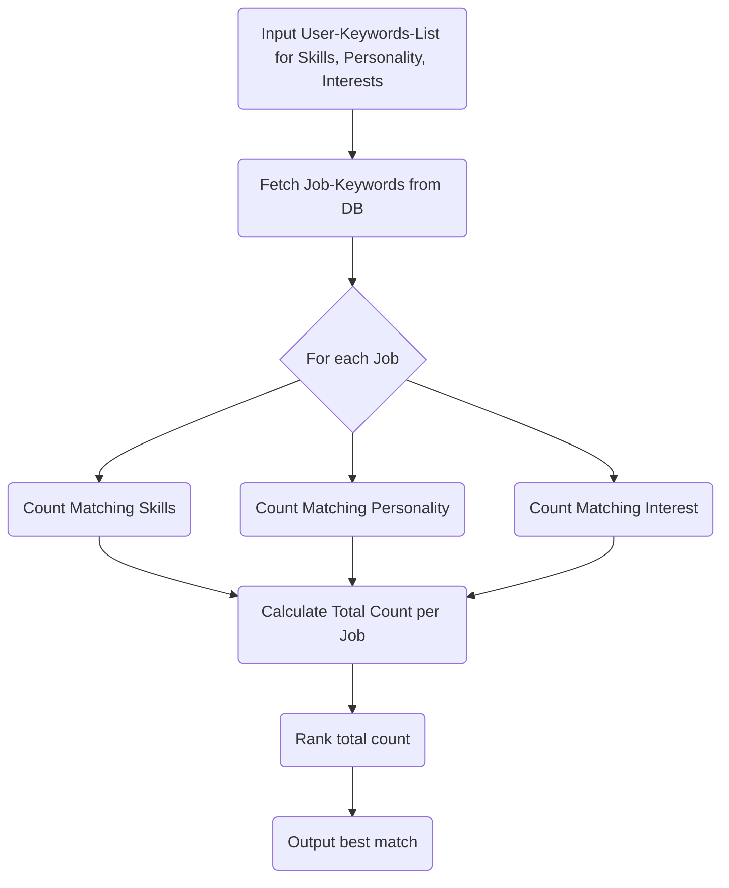

# Apprenticeship Match Making Service

This service matches users with suitable apprenticeships based on their skills, interests, and personality traits.

## Tech-Stack

- kotlin 2.x.x
- spring-boot 3.x.x

## API Endpoint

### POST `/api/apprenticeship/match`

## Apprenticeship Recommendation Algorithm Flowchart

